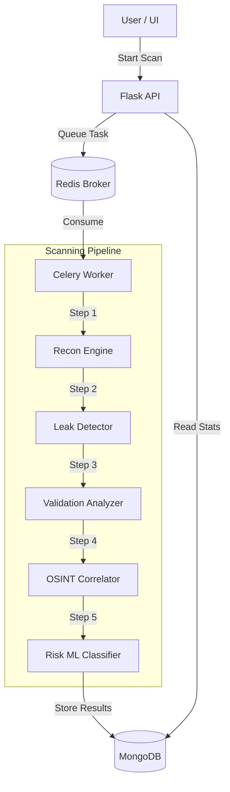

# 🦅 ADLIP v2 (Automated Data Leak Intelligence Platform)

> **Next-Gen Offensive Security & Leak Detection Engine**


---

## 🚀 Overview

**ADLIP v2** is a sophisticated cybersecurity tool designed to bridge the gap between simple regex scanners and full-scale vulnerability suites. It automatically crawls, detects, validates, and intelligence-checks sensitive data leaks.

### The Problem
Modern web applications often unintentionally expose sensitive data such as API keys, JWT tokens, and PII. Manual detection is slow, and traditional scanners rely solely on regex, leading to high false positive rates and "alert fatigue."

### The Solution
ADLIP provides a **lightweight, AI-augmented** platform that:
1.  **Crawls** hidden endpoints.
2.  **Validates** secrets for authenticity (structure, entropy, DNS).
3.  **Correlates** findings with OSINT (breach data).
4.  **Scores** severity using Machine Learning.

---

## ✨ How It Works (The Core Modules)

ADLIP operates through a pipeline of specialized modules, each acting as a filter to refine raw data into actionable intelligence.

### 🕸️ Module 1: Web Crawler & Recon Engine
*The "Hunter"*
- **Role**: Discovers attack surface.
- **Function**: Accepts a target URL, crawls up to 1-depth, and specifically hunts for **inline JavaScript** and **external script files** where secrets often hide.
- **Safety**: Built-in protections against infinite loops and external domain drifting.

### 🔍 Module 2: Leak Detection Engine
*The "Observer"*
- **Role**: Identifies potential leaks.
- **Function**: Scans collected content using **800+ Regex patterns**, **Shannon Entropy** analysis (to find random-looking strings like keys), and **NER** (Named Entity Recognition) for PII.
- **Accuracy**: Optimized to ignore common false positives (CSS hex codes, UUIDs).

### ✅ Module 3: Validation & Exploitability Analyzer
*The "Judge"*
- **Role**: Verifies findings offline.
- **Function**: Checks if a secret is structurally valid *without* sending active packets to the target (passive safety).
    - **JWTs**: Checks signature structure and expiration.
    - **Tokens**: Validates Base64 decoding and entropy thresholds.
    - **Emails**: Verifies domain existence via DNS MX records.

### 🌍 Module 4: OSINT Leak Checker
*The "Intelligence"*
- **Role**: Contextualizes risk.
- **Function**: Cross-references findings with **offline OSINT datasets** to answer "Is this already exposed?"
    - Checks against known **breached domains**.
    - Identifies **disposable/burner emails**.
    - Flags known sensitive files (e.g., `.env`, `.git/config`).
    - **Privacy First**: Fully offline correlation; no external API calls to third parties.

### 🧠 Module 5: AI Risk Classifier
*The "Brain"*
- **Role**: Scores severity.
- **Function**: A **Hybrid Risk Engine** that fuses static rules with a **RandomForest ML model**.
    - **Input**: Finding type, validation status, OSINT context, entropy.
    - **Output**: A precise **Risk Score (0-100)** and Severity Label (Low/Medium/High).
    - **Philosophy**: ML is advisory but bounded—it can elevate risk based on context but cannot override hard safety rules.

---

## 🏗️ Architecture



## 🛠️ Tech Stack

- **Backend Framework**: Flask (Python)
- **Task Queue**: Celery
- **Broker & Cache**: Redis
- **Database**: MongoDB (NoSQL)
- **Containerization**: Docker & Docker Compose
- **ML Engine**: Scikit-learn (RandomForest)

## ⚡ Getting Started

### Prerequisites
- Docker & Docker Compose installed.

### Installation

1.  **Clone the repository**:
    ```bash
    git clone https://github.com/GreenThenics/ADLIP.git
    cd backend
    ```

2.  **Start the Engine**:
    ```bash
    docker-compose up --build -d
    ```

3.  **Verify Status**:
    The Project will be available at `http://localhost:5000/api/ui`.

## 🔌 API Reference

### 🟢 Start a Scan
`POST /api/start_scan`
```json
{
  "url": "https://example.com",
  "created_by": "cli_user"
}
```

### 🔵 Get Statistics
`GET /api/stats`
Returns system-wide metrics, risk distribution, and top leak categories.

### 🟡 Get Scan Results
`GET /api/leaks/<task_id>`
Returns enriched findings with Risk Scores (0-100), ML Analysis, and OSINT labels.

---

## 🤝 Contributing

Contributions are welcome! Please open an issue or submit a PR for any new features or bug fixes.

## 📄 License

This project is licensed under the **MIT License**.
